> 보안성 검토로 인해 이전의 커밋은 비공개 처리되었습니다.

## 참치의 손아귀 "머스타드일까용?"
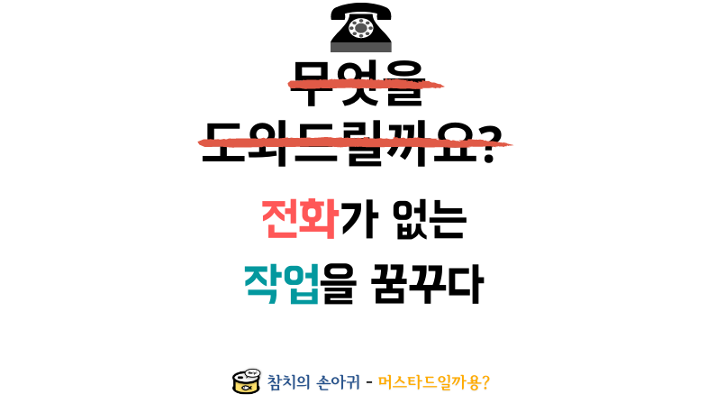

## 팀 소개 
### 참치의 손아귀
공군의 낮은 기수 병사들을 일컫는 속어, **참치**끼리 모여서 손아귀에 상을 넣겠다는 포부를 가지고 만들었습니다.   

정보통신부대의 불편한 작업 시스템 하에서 작업하며 어려움을 겪던 병사들입니다. 늘 개선할 방법이 없을까 고민하다 이번 온라인 해커톤을 통해 직접 만들어봐야 겠다는 생각으로 모인 팀입니다. 전화 없는 작업을 꿈꾸며 오늘도 머스타드일까용?(무엇을 도와드릴까요?)를 외치는 전화 응대자들을 응원하고 있습니다.

### 팀 구성원
- 심규진 (bluejoy32@gmail.com), Github: [bluejoyq](https://github.com/bluejoyq)
- 조준오 (herojeff02@gmail.com), Github: [herojeff02](https://github.com/herojeff02)
- 정유빈 (jyb1018@gmail.com), Github: [jyb1018](https://github.com/jyb1018)
- 이현석 (hemiker@naver.com), Github: kasuar

## 프로젝트 소개
### 머스타드일까용?
전화를 받을 때 늘 외치는 대사 **무엇을 도와드릴까요?** 를 빠르게 말했을 때의 발음을 재치있게 변형해 프로젝트 명으로 정했습니다. 말 그대로 정보통신 업무에 대해서 무엇이든 도와드리는 웹 사이트를 제작했습니다.
**정보통신부대(가칭) HelpDesk 부서** 업무의 일부를 웹 서비스로 보조할 수 있다는 컨셉/가능성을 제시하고자 기획한 프로젝트입니다.


### 프로젝트 시연 동영상
> 이미지를 클릭해주세요!

[](https://youtu.be/lL-haYwY3GQ)

## 프로젝트 분석
### 배경
- **정보통신부대(가칭)** 은 하늘망, 항공작전, 방공 소프트웨어의 개발 및 유지보수와 서버운영, **오산 공군기지**에 대한 **정보통신 지원 업무**를 수행하는 부대입니다.

- **정보통신부대**는 원활한 정보통신 지원을 위해 **HelpDesk 체계**(가칭)를 통해 업무 의뢰를 접수합니다. 접수, 업무 분배, 안내 등을 담당하는 **사용자지원센터**(가칭) 부서가 신청자들에게 작업 신청 방법, 작업 부서 등을 알려주고, 담당 부서로 업무를 인계합니다.

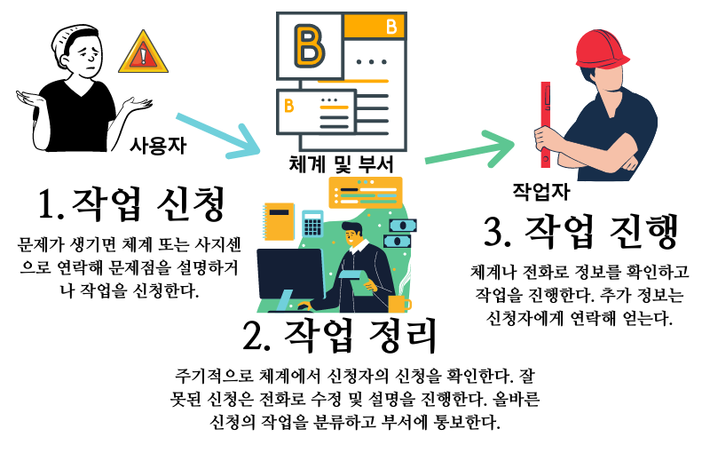

- **사용자지원센터**는 부서들의 업무 관리와 업무 안내 외에도, **대부분의 작업**을 위한 모든 문의들, 그리고 오산기지의 콜센터라는 별명처럼 **답을 얻기 힘든 질문들**이 사용자 지원 센터로 향합니다. 질문 및 신청자들, 그리고 작업자들은 많지만 업무 분배 부서가 하나여서 **병목 현상**이 발생하게 됩니다.

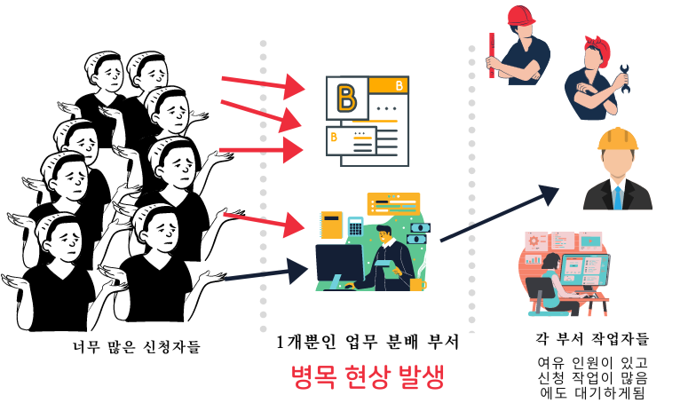

- **사용자지원센터**로 걸려 오는 전화 중 체계 이용 방법, 전화번호 등의 단순 문의가 많아 정작 중요한 문의의 처리가 지연되고 있습니다. 또한, **HelpDesk 체계** 자체의 기능이 많이 부족해 작업자나 신청자들 모두 많은 불편을 겪고 있습니다. 

이 프로젝트는 위의 문제를 **오픈소스, 웹 서비스, 그리고 우리의 아이디어**로 해결할 수 있을지 고민하는 데서 시작됐습니다.

### 취재 및 인터뷰
우선 어떠한 문제가 존재하는지에 대한 조사를 위해 직접 관리 부서 역할의 사용자 지원 센터에 방문해
- 부서의 존재 이유와 어떤 업무를 하는지 
- 작업은 어떻게 들어오고 어떤 기준에 따라 부서를 나누는지
- 업무에 있어서 어떤 어려움을 겪는지
- HelpDesk 체계의 문제점과 개선점
- 현 업무 분배 시스템의 문제점과 개선점

등에 대해 조사를 해보았습니다. 또한 사용자 지원 센터의 **업무 접수, 분배 기능**을 웹에서 구현하기 위해 
- 각 부서가 담당하는 작업들과 그 작업에 필요한 정보.
- 작업의 신청부터 분배까지의 과정

까지 조사했습니다. 취재 내용은 **보안상 문제**로 전부 공개할 수 없는 점 양해 바랍니다.

또한 같은 부대의 부서별 **작업자**에게도 인터뷰를 진행해
- 부서에서 담당하는 업무의 종류
- HelpDesk 체계와 사용자 지원 센터에 대한 생각
- 작업 접수 과정의 개선점

을 조사해 정리했습니다.


### 설문조사
오산 기지 장병 일부를 대상으로 사용자 지원 센터와 HelpDesk 체계에 대한 인식과 해결방안에 대한 반응을 보기 위해 설문 조사를 진행했습니다. 설문조사의 질문은 [**이곳**](ask.md)을 참고해주세요.

설문 조사의 결과는 다음과 같습니다.
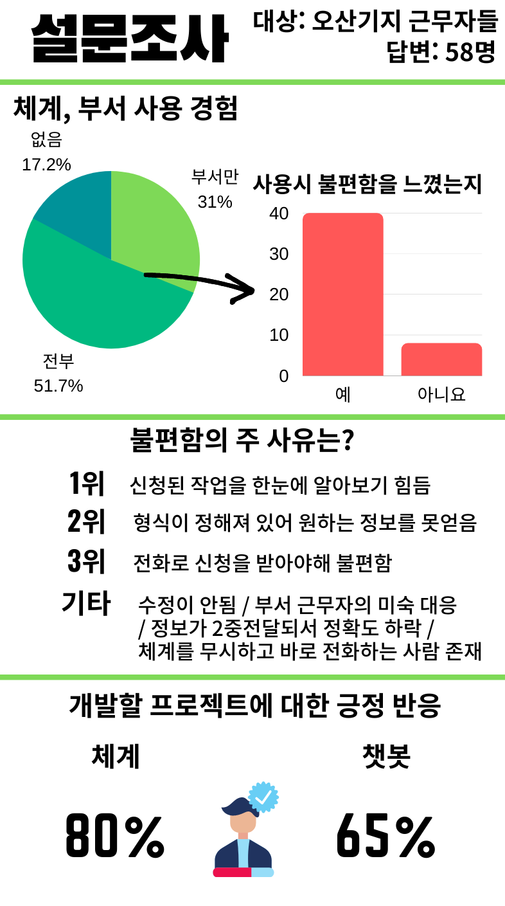

### 기존 체계와 사용자 지원 센터의 문제점
인터뷰, 설문, 그리고 경험을 바탕으로 현재 체계와 사용자 지원 센터의 문제점을 크게 네 가지로 정리했습니다. 이 뒤에 해결 방안을 제시하겠습니다. 아래 사진은 인트라넷 내 실제 HelpDesk 체계의 스크린샷 2장입니다. 
> 보안성 검토 승인된 사진입니다.


|기존 체계의 작업 조회 페이지|
|:-------------------------:|
|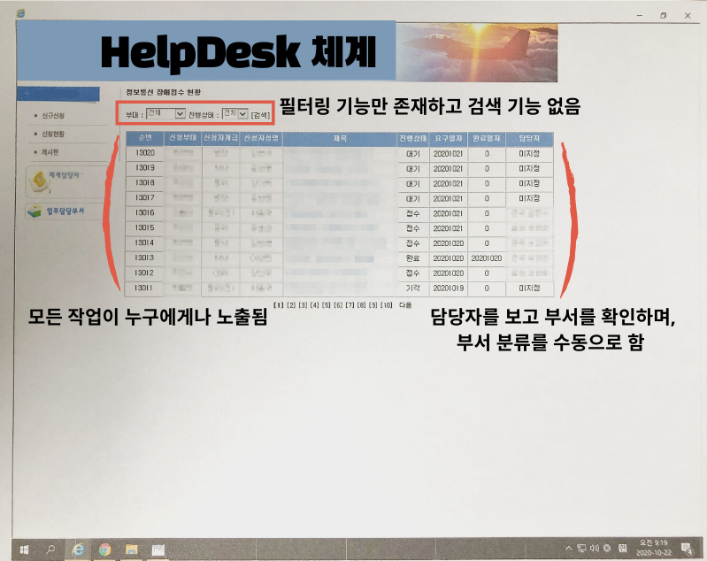|

|기존 체계의 작업 신청 페이지|
|:-------------------------:|
|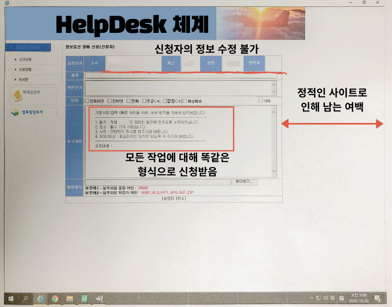|


- **사용자 지원 센터의 콜센터화 및 대응 미숙**  
간단한 질문들은 사용자 지원 센터에서 해결해줄 수 있다 보니 단순한 문의를 이곳에 하는 경우가 많습니다. 이에 따라 대응할 항목들이 지나치게 많아지고 근무자의 실수를 유발하는 등 효율이 저하됩니다. 단순하거나 반복적인 문의를 무언가 대신 처리할 수 있다면 업무 부담이 줄어들 것입니다.

-  **공통된 입력 양식으로 인한 후속 확인 작업의 부담**   
신청시 업무 처리에 충분하지 않은 정보를 입력받습니다. 이는 입력 폼이 기본 정보만을 담는 정해진 하나만 사용되기 때문인데, 결국 신청자에게 전화로 추가 정보를 요청해야 합니다. 상황과 작업에 맞게 정보를 요청하고 입력 받을 필요성이 있습니다.

-  **무분별한 열람**  
신청 작업과 내용이 신청자와 작업 부서에서만 열람 가능해야 하지만, 실상은 누구나 확인할 수 있는 상태이며, 처리 결과와 공문 또한 모두에게 공개됩니다. 보안이 중요한 만큼, 이는 반드시 수정되어야 합니다. 

-  **편의성을 고려하지 않은 UI/UX**   
버튼과 요소의 위치나 순서, 개연성을 사용자가 이해하기 어렵습니다. 신청 후엔 수정이 불가하며, 작업의 변동 여부도 직접 새로 고침을 눌러 확인해야 합니다. 또한, 검색 기능이 없어 원하는 작업을 빠르게 확인하기 힘듭니다. 창의 크기를 줄였을 때 내용을 제대로 볼 수 없다는 불편함도 있습니다.


### 해결 방안 모색
- **단순/반복적 문의에 최적화**   
단순한 문의는 AI나 웹사이트의 기능으로 충분히 해결할 수 있게 하고, 특별하거나 전례가 없는 상황에서만 근무자들이 응답하게 하면 부서의 업무 능률을 개선하고 시간을 절약할 수 있습니다. 필요한 정보를 빠르게 얻을 수 있으므로 사용자 입장에서도 편의성이 증가합니다. 

-  **입력 양식 최적화**  
각 부서의 업무 처리에 필수 불가결인 정보를 신청 시 사용자가 입력하게끔 합니다. 업무 작업자는 작업에 필요한 정보를 추후 전화 확인 없이 필요한 정보를 웹에서 바로 확인할 수 있도록 합니다.

-  **무분별한 열람 차단**  
사용자 본인이 신청한 작업이나, 처리자 본인에게 배정된 업무만 조회 가능하게 합니다. 이 조치를 통해 군사 보안 유출의 위험성을 현저히 낮출 수 있습니다.

-  **UI/UX 대대적 개편과 재설계**  	 
직관적이고 단순한 디자인과 사용자 중심 UX를 접목해 간단한 사용 환경을 제공합니다. 다양한 사용자 층을 모두 고려하며, 여러 작업 환경 및 사람들에게 어렵지 않고 편리하게끔 만들어야 합니다. 

## 프로젝트 기획
### 개발 목표
위의 해결 방법을 기반으로 개발 목표를 정했습니다.
1. 작업의 상태를 진행, 거부, 완료의 3단계로 세분화해 거부나 진행 상태의 작업을 삭제나 수정 가능하게 합니다. 작업은 자신이 신청하거나 자신의 부서로 신청된 것만 확인 가능하게 합니다.
2. 모든 사용자의 수준이나 목적에 맞는 UI를 제공합니다. 체계에 익숙하거나 목적이 확실한 사용자는 메인 화면의 격자를 이용해 원하는 기능으로 빠르게 안내합니다. 체계에 익숙하지 않거나 작업을 잘 모르는 사용자는 AI를 이용해 목적을 인식시켜 필요 기능으로 안내합니다.
3. 사용자가 신청한 작업의 상태에 변동이 있거나, 처리자에게 작업이 배정될 때 웹사이트에 Toast 알림을 표시합니다.
4. 위와 연계해 사용자가 신청한 작업이나 처리자의 부서로 배정된 작업을 한눈에 확인할 수 있게 하며, 검색 및 필터링 기능을 제공합니다. 거부일 경우 거부 사유, 완료일 경우 최종 조치 내용을 제공합니다.
5. 일정 수준으로 너비가 줄어들 때 모바일 화면을 표시하도록 반응형 레이아웃으로 제작합니다. 동시 작업에 무리가 없도록 설계하며 모든 상황에 맞는 화면 배치를 구성합니다.

### 사용 기술과 이유
|React.js|Node.js|
|---|---|
|||
|컴포넌트 단위로 설계가 가능해, 유사하지만 각각 상이한 양식 페이지를 다수 설계해야 하는 저희의 웹사이트에 적합합니다. 다양한 오픈소스 라이브러리들을 이용해 빠르게 개발하고 입맛대로 수정하기에 좋다고 판단했습니다.|효율적인 API 서버를 만들 수 있었고, event 방식으로 이루어져 비동기에만 유념하면 쉽게 안정적인 서버를 만들 수 있어 채택했습니다. 또한 다양한 라이브러리들을 이용해 빠른 속도로 개발할 수 있었습니다.|

|MySQL|Google DialogFlow|
|---|---|
||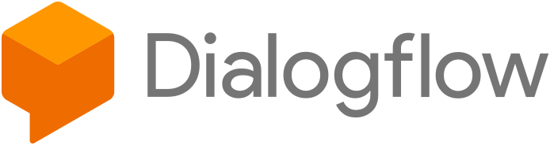|
|간단하고 빠른 기간 내 개발이 가능한 database를 사용했습니다.|구글에서 제공하는 챗봇 플랫폼으로 강력한 통합 기능을 제공해 웹과의 연동이 쉽습니다. 객체, 맥락 인식 등 챗봇 빌더로서 중요한 기능을 가지고 있으면서도 사용법이 비교적 간단해 선택했습니다.|

### 디자인 프로토타입
#### 1차 프로토타입
**삼성 노트**와 **KAKAO oven**을 이용해서 웹페이지의 핵심 기능,  **챗봇과 메인 격자 버튼** 위주로 스케치를 제작했습니다. 미리 **React**를 사용하기로 결정했기 때문에 컴포넌트 단위로 나눠서 스케치가 이루어졌습니다.

메인에 큰 신청 버튼을 배치해 처음 체계를 접하는 사용자도 빠르게 목적을 달성할 수 있도록 했으며, 처리자에게 배정된 작업이나 사용자가 신청한 작업의 개수를 좌측의 유저 정보에서 확인 가능하게 했습니다. 

챗봇은 우측 구석에서 Floating Action Button으로 대기합니다. 사용자가 활성화 할 때만 채팅창이 나타나도록 해 화면 배치를 깔끔하게 구성했습니다.
> 대표 이미지만 선별했습니다.


메인 페이지             |  작업 조회 페이지
:-------------------------:|:-------------------------:
  |  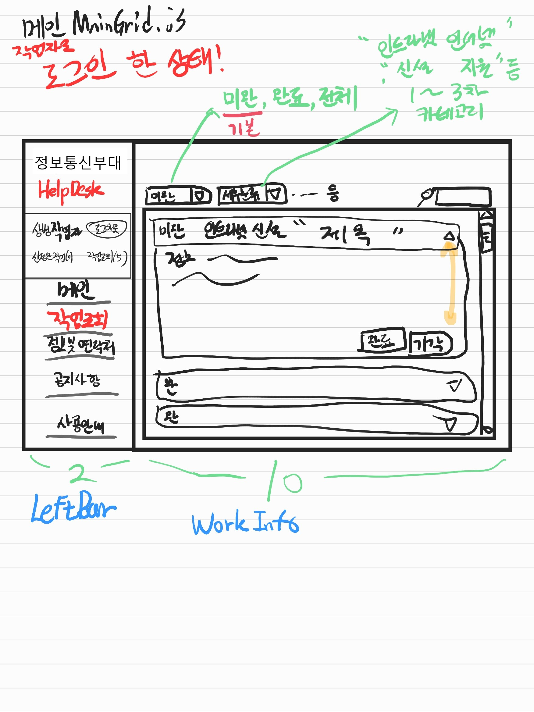

| kakao 목업툴 OVEN을 이용한 메인페이지 목업화 |
|---|
|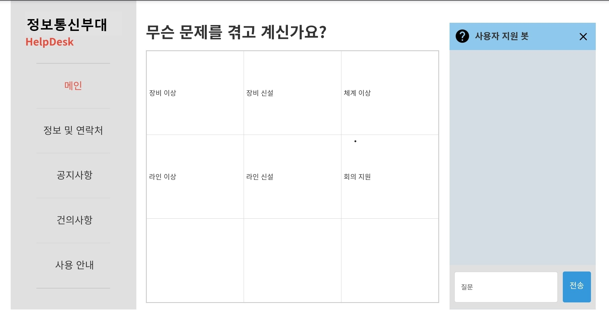|

### 2차 프로토타입
**Adobe Comp, Adobe XD**를 이용해 최종 웹 디자인에 가깝게 프로토타입을 제작했습니다. 좌측 메뉴 바를 상단으로 이동하고, 디자인 언어를 확정했습니다. Accent Color을 채도가 짙은 하늘색으로 설정하여 사용자로 하여금 공군의 영역인 하늘을 연상하게 합니다. 
> 대표 이미지만 선별했습니다.

| OVEN의 목업을 Adobe Comp로 표현 |
|---|
|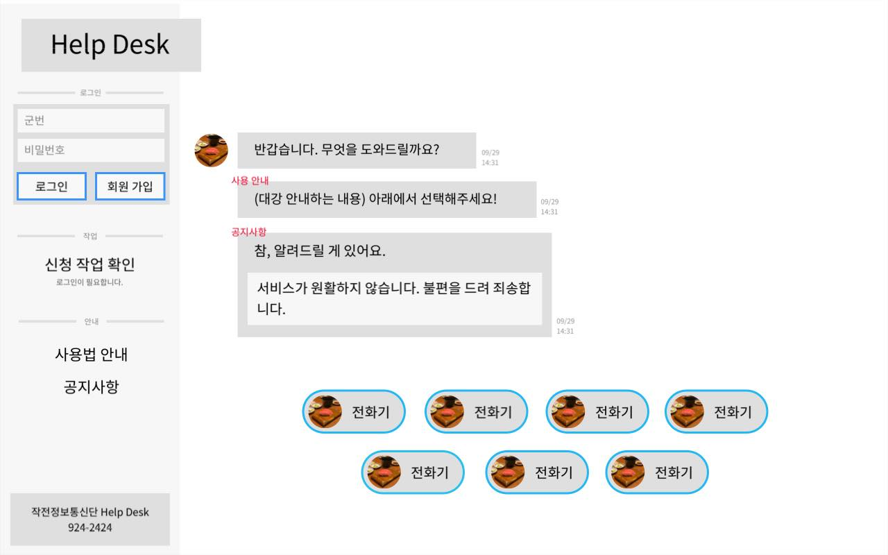|

| 작업 신청 페이지의 XD 디자인 |
|---|
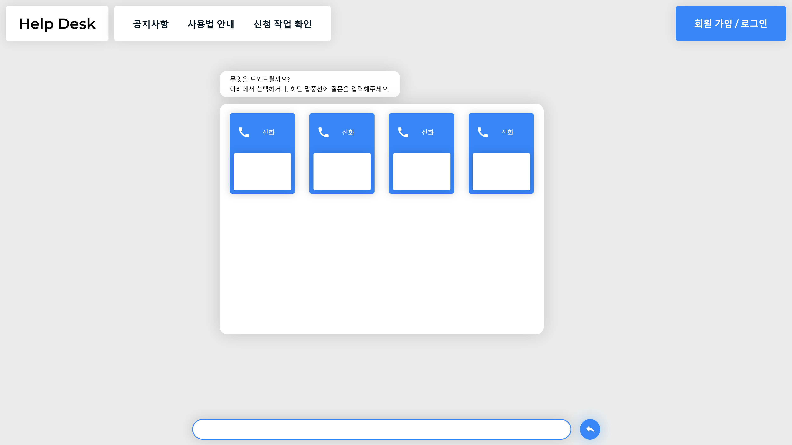|


| 작업 선택 페이지의 XD 디자인 |
|---|
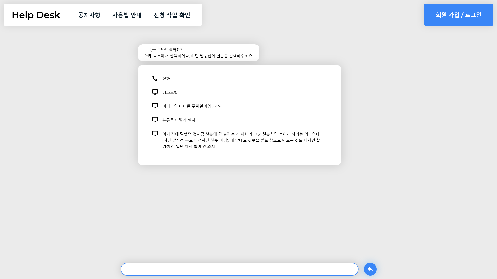|
### 작업 신청 흐름도 설계
취재한 내용을 바탕으로 **챗봇**과 **메인**이 어떤 식으로 작업을 분류할지, 분류된 작업들에 필요한 정보는 무엇이며, 어디 부서로 가는 작업인지를 정리해 보았습니다. 이 흐름도들을 바탕으로 **챗봇**과 **메인**에서는 작업을 처리하고, 필요한 정보를 받으며, 분류합니다.
> 대표 이미지만 선별했습니다.

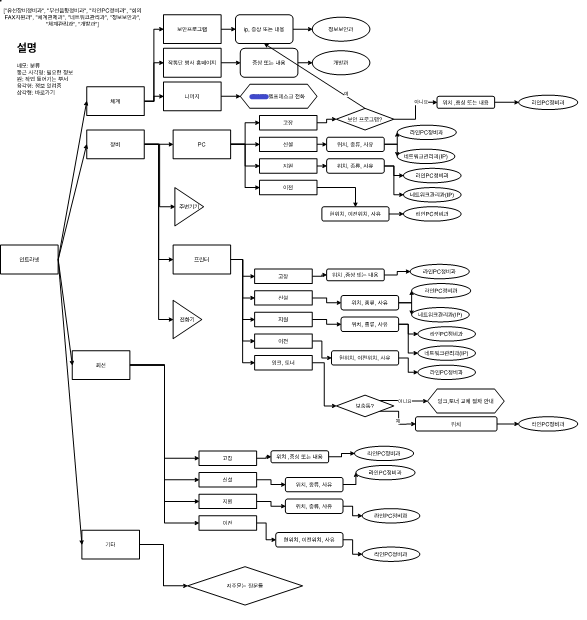

### API 및 DB 설계 
크게 4가지로 다음과 같이 나누어 설계했습니다 :
- react 페이지를 렌더링하는 프론트 서버
- api 서버를 담당하는 백엔드 서버
- mysql이 가동 되는 DB 서버
- 챗봇

작업과 관련된 API는 /work 주소에서 다루며 계정과 관련된 API는 /auth 주소에서 다루고 있습니다.  

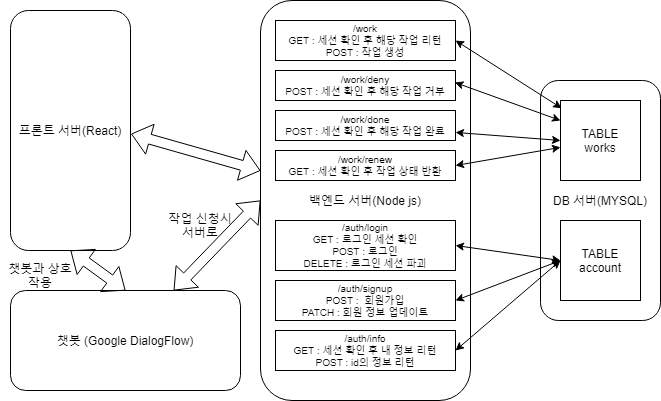

- TABLE account 구조

| Field      | Type          | Null | Key | Default | 설명 |
|---|---|---|---|---|---|
| userId     | varchar(12)   | NO   | PRI | NULL    |유저의 고유한 군번|
| userName   | varchar(10)   | NO   |     | NULL    |유저의 이름|
| userTel    | varchar(10)   | NO   |     | NULL    |유저의 전화번호|
| userUnit   | varchar(30)   | NO   |     | NULL    |유저의 부서|
| userRank   | varchar(3)    | NO   |     | NULL    |유저의 계급|
| userPWHash | varchar(1000) | NO   |     | NULL    |유저 비밀번호 해쉬값|
| userPWSalt | varchar(1000) | NO   |     | NULL    |유저 비밀번호 솔트값|
| isWorker   | tinyint(1)    | NO   |     | NULL    |작업자인가 여부|
| userType   | varchar(2)    | NO   |     | NULL    |작업자일시 부서 코드명|

- TABLE works 구조

| Field            | Type          | Null | Key | Default | 설명 |
|------------------|---------------|------|-----|---------|----------------|
| workId           | int(11)       | NO   | PRI | NULL    | 작업의 고유 번호, 자동 증가함 |
| workUserName     | varchar(10)   | NO   |     | NULL    | 작업 신청자 이름 |
| workUserTel      | varchar(10)   | NO   |     | NULL    | 작업 신청자 연락처 |
| workUserUnit     | varchar(30)   | NO   |     | NULL    | 작업 신청자 전화번호 |
| workUserRank     | varchar(3)    | NO   |     | NULL    | 작업 신청자 계급 |
| workOtherInfo    | varchar(1000) | NO   |     | NULL    | 작업 제목 및 기타 정보 |
| userId           | varchar(12)   | NO   | MUL | NULL    | 작업 신청자 아이디, 외래키 |
| workStatus       | varchar(1)    | NO   |     | w       | 작업 상태(w: 대기중, f: 완료, n:거부) |
| workRegisterTime | datetime      | NO   |     | NULL    | 작업 등록 시간 |
| workEndTime      | datetime      | YES  |     | NULL    | 작업 완료 시간 |
| workComment      | varchar(500)  | YES  |     | NULL    | 완료나 거부시 코멘트 들어가는 공간 |
| workUserType     | varchar(2)    | NO   |     | NULL    | 작업 해당 부서 종류 |

### 챗봇 설계
| 챗봇의 제작 과정 |
|---|
|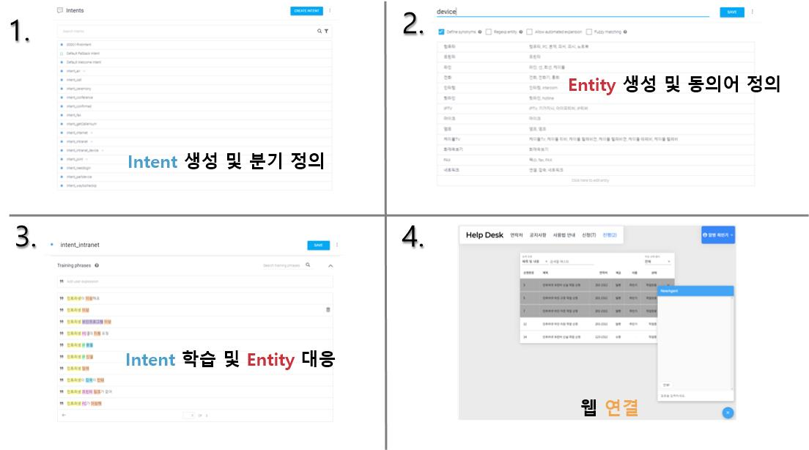|

| 챗봇의 작동 |
|---|
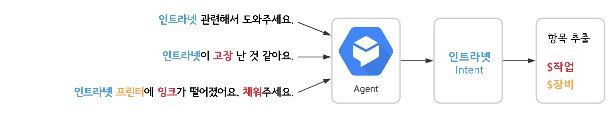|

## 프로젝트 구현 과정
### 역할 분배
> 구름 ide를 통해 한 pc에서 작업해, 커밋은 모두 한명이 진행했습니다.
- 조준오 : UI 디자인 및 프론트엔드 담당
- 심규진 : 프론트엔드 및 백엔드(DB, 서버, 연동 등) 담당
- 정유빈 : 챗봇 엔진 담당
### 제작 과정
| 제작과정 1 - 초기 상단바와 회원가입 폼|
|---|
|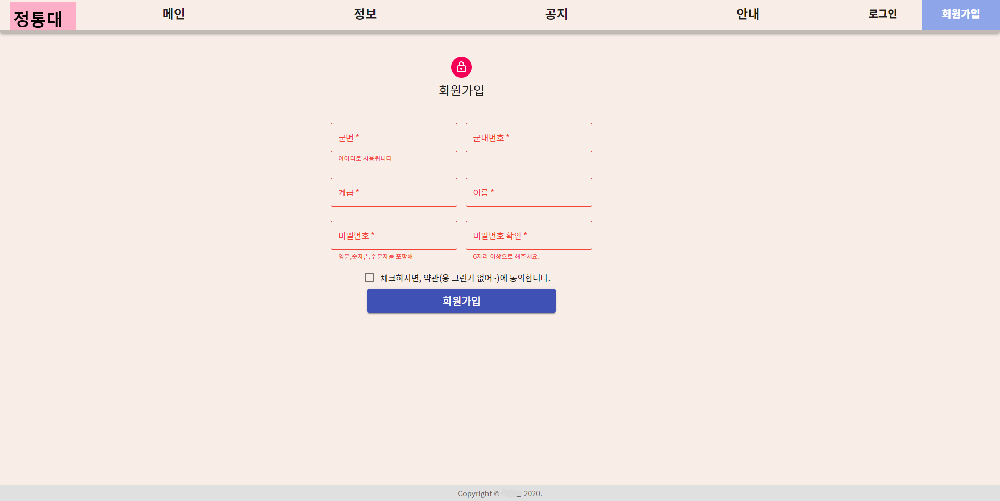|

| 제작과정 2 - 초기 메인 화면 |
|---|
|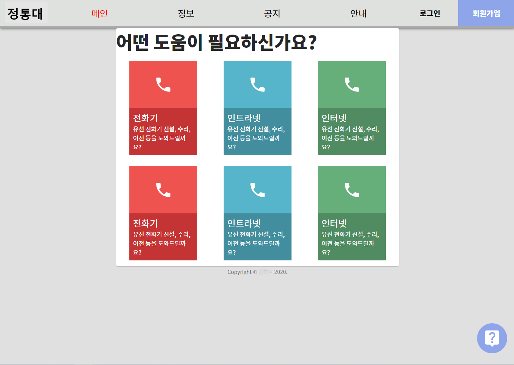|

| 제작과정 3 - 상단바와 메인 수정 |
|---|
|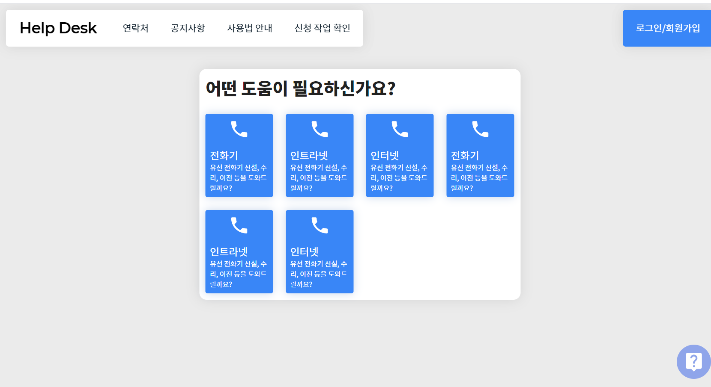|

| 제작과정 4 - 반응형 레이아웃 추가|
|---|
|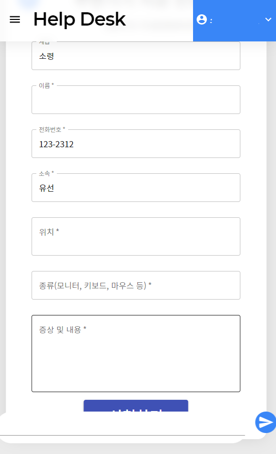|

| 제작과정 5 - 챗봇 추가|
|---|
|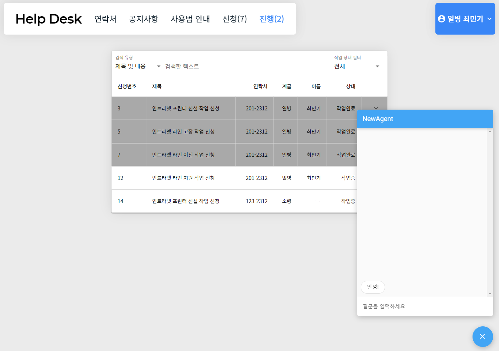|


## 프로젝트 결과
### 기능 소개
| 실시간 갱신 + 알림 |
|---|
|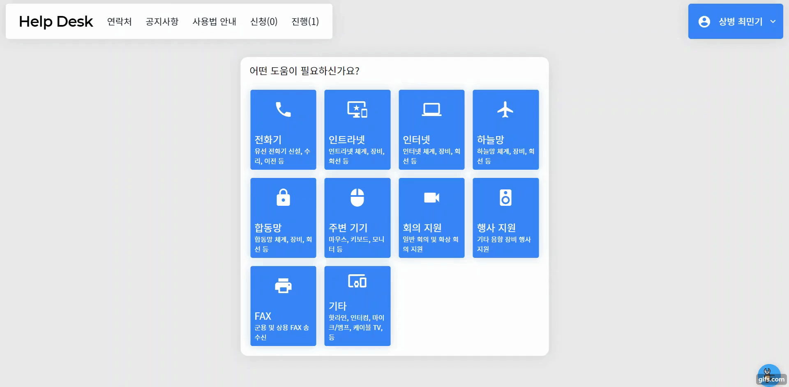|

| 반응형 레이아웃 |
|---|
||

| 챗봇 이용 |
|---|
|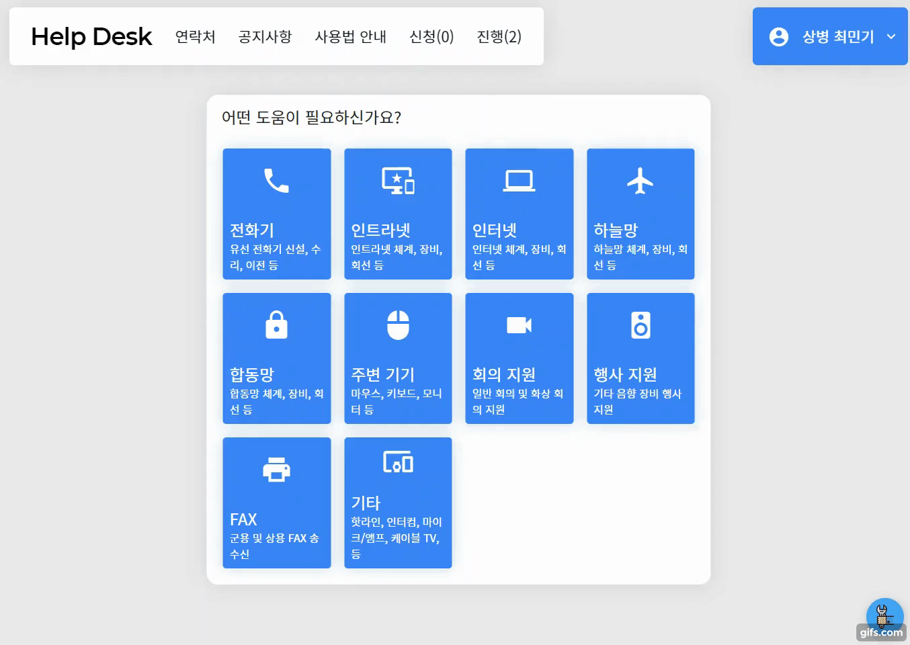|

| 검색 및 작업 처리 |
|---|
|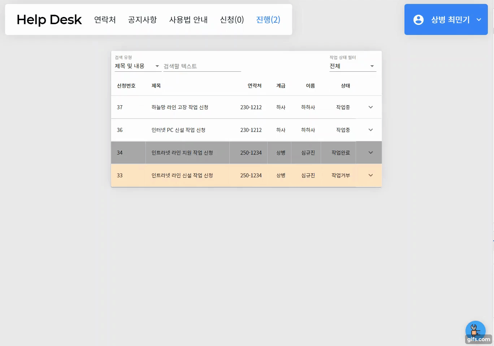|

| 개선된 작업 신청 과정 |
|---|
|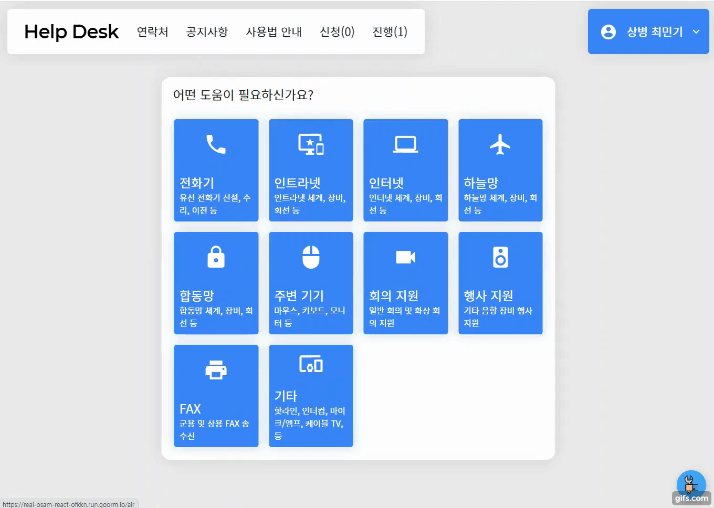|

### 향후 발전 가능성

| 질문 컴포넌트 JSON 데이터 |
|---|
|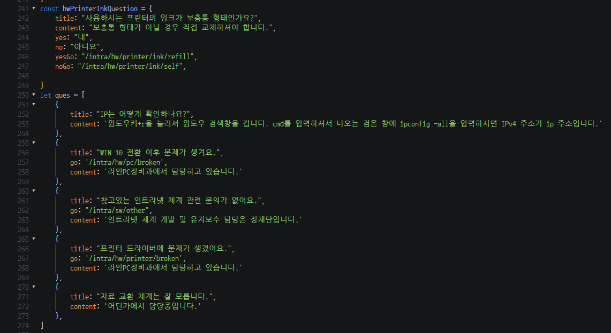|

| 선택형 메뉴와 입력 컴포넌트 JSON 데이터 |
|---|
|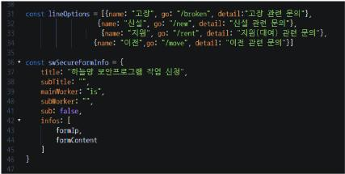|

- **유연한 재사용성**  
	간단히 JSON 파일을 수정하는 것만으로도 작업 신청 페이지를 제작 가능해, 쉽게 자신의 부서에 맞추어 업무 분류를 제작 가능합니다. 높은 재사용성을 기반으로 이 오픈소스를 군 내의 다른 HelpDesk 부서들에서도 자신들의 부서의 실정에 맞게 수정해 사용이 가능합니다.

| 챗봇의 트레이닝 페이지 |
|---|
|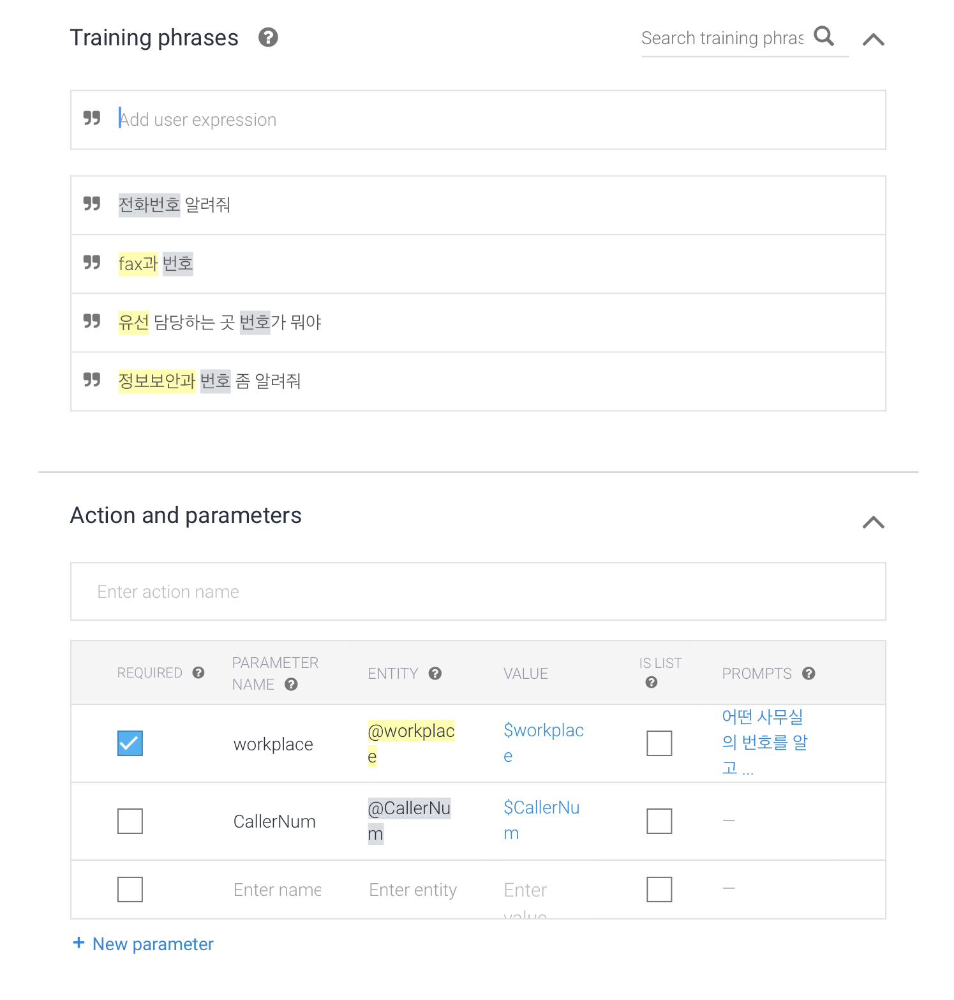|

- **쉬운 챗봇 플랫폼**  
	의도와 맥락, 객체라는 세가지 요소만 GUI를 통해 설정하면 챗봇이 완성되는 구글의 오픈소스 dialog flow로 챗봇을 제작해 챗봇 제작의 진입 장벽도 낮습니다. 필요할 경우 직접 챗봇을 생성 후, 연결 Id를 변경하는 것만으로도 자신만의 챗봇이 연결됩니다. 역시 자신의 부서에 맞게 쉽게 수정이 가능합니다.

- **높은 범용성**  
	HelpDesk 기능을 하는 모든 부서들이 잠재적 타켓입니다. 정보화 시대에 진입했지만 여전히 전화 안내원들은 서비스업에서 큰 부분을 차지하고 있습니다. 너무 많은 문의에 지친 전화 안내원들이 이런 웹을 이용해 업무 부담을 줄이고, 정말 중요한 업무에 집중하도록 업무 효율을 높일 수 있습니다.

	
### 기대 효과
1. Web 기술과 AI 기술의 결합으로 사람의 업무를 일부 대체할 수 있음을 확인하며 '업무 자동화' 라는 최종적 목표에 한발짝 다가갈 수 있습니다.
2. 전화의 감소에 따른 전화응대 횟수 감소로 근무자의 부담을 줄여 중요한 업무에 집중할 수 있도록 돕습니다.
3. 사용자는 앞으로 타 사용자와 사용자 지원 센터와의 전화가 끊기기 전까지 하염없이 기다리지 않고, 직접 작업의뢰를 하거나 궁금증을 해소해 불필요한 대기 시간을 줄일 수 있습니다.
4. 작업자는 작업에 필요한 정보를 단번에 확인할 수 있어 편리하고, 새로운 작업의뢰를 전화로 전달받을 필요 없이 알림으로 바로 확인하여 대기 시간을 단축시킬 수 있습니다.
5. 이 프로그램을 오픈소스로 내놓아 타 부대에서 같은 처지에 있는 부서를 위해 타 사용자가 대가 없이 변형해 사용 가능하며, 서로 의견 반영을 통해 점점 발전해나가는 프로젝트가 될 수 있습니다. 위에서 언급한 것처럼 자신의 작업을 쉽게 추가 가능해 다른 부대에서도 쉽게 적용할 수 있을 것으로 기대됩니다.


### 체험 후기
> 실제 정보통신부대 병사들의 사용 후기를 담았습니다.
- 이@석 상병, 제@택 상병 무선음향정비과   
평소에 행정 업무를 보면서 기존 체계를 매번 확인하며 작업자들에게 통보해야했는데, 변경 사항을 바로 볼 수 있어 편할 것 같다. 또한 힘들게 찾지 않아도 우리 작업만 쉽게 확인 가능해서 좋다. 효율적인 업무가 가능할 것 같다. 늘 업무를 볼 때 한 쪽 화면은 엑셀을 키고 한쪽 화면만으로 체계를 확인하는데 화면 크기가 맞춰지지 않아 불편했지만 이걸 사용하면 맞춤형으로 줄어들어 확인이 편할 것 같다.
	 
- 장@현 상병 체계관제과  
사용자들이 전화로 정보를 전달해 알아듣기 힘들었지만 이거는 편할듯. 차단 기능이 없어서 아쉽다.

- 조@형 일병 체계관리과  
평소 사지센 근무자들이 바빠서 전화를 자주 하지 못했는데, 자주 할 수 있을 것 같다.

- 박@민 병장 사용자지원센터(관리부서)  
좋다. 좋네. 잘 만든 것 같다. 전역하기 전에 실용화 되어서 업무가 하루빨리 중요한 곳에 집중할 수 있도록 변하면 좋겠다. 평소 꼼꼼한 성격이여서 사용자들에게 자세히 안내해주는 과정도 나름 재밌는데 그럴 수 없어서 슬프다. 근데 전역이 더 빠를듯.

- 정@빈 상병 유선정비과  
이상하게 전화기 관리한다는 이유로 전화번호를 물어보는 전화가 은근 많은데 이렇게 간단히 번호를 얻을 수 있어 번호 찾는 전화가 사라진다면 참 행복할 것 같다. 여기엔 번호정보가 있는 부서가 몇 없지만, 제대로 도입되서 되도록 많은 전화번호를 얻을 수 있으면 좋겠다.

### 아쉬운 점
- 사용자와 부서간의 채팅을 구현하지 못함.
- 챗봇에서 바로 서버로 요청을 보내야하는데 못함.
- 공지사항... 더미로 마무리한게 아쉬움.
- 좀 더 많은 분기점을 두고 싶었는데, 지금도 너무 많아서 생략

## 프로젝트 사용법
### 컴퓨터 구성 / 필수 조건 안내
* ECMAScript 6 지원 브라우저 사용
* 권장: Google Chrome 버전 77 이상

### 기술 스택 
#### Server(back-end)
 -  nodejs v12.18.4
 -  express
 -  mysql
 -  Dialog Flow
 
#### front-end
 -  react.js
 -  react material-ui

### 실행 안내
실행 링크 : https://real-osam-react-ofkkn.run.goorm.io  
실행 전에 config 파일을 채워주셔야 합니다.

#### 기본 환경 구성
```bash
$ git clone git주소
$ yarn or npm install
```
#### 프론트엔드
```bash
$ yarn start or npm start
```
#### 백엔드
```bash
$ service mysql start // mysql 서버 켜기
$ npm run-script server
$ // 개발시에는 npm run-script server:dev
```
 
## 저작권 및 사용권 정보
- [MIT](https://www.mit.edu/~amini/LICENSE.md)

## 기타 정보
### 소감
- 조준오 : 비대면으로 진행돼 팀원/멘토 간 소통에 어려움이 있었고, 각 부대의 사이버지식정보방 환경과 근무 스케줄에 영향을 많이 받아 업무량 조절에도 어려움이 있었다. 팀원들에게 미안하다. 장기간으로 진행됐지만 앞서 언급한 비효율적인 면 때문에 시간이 넉넉하지는 않았다.(언제 군대에서 코딩으로 굴러 보겠누 ㅋㅋㅋㅋ 오랜만에 과제 하는 기분이라 신선하다 아 ㅋㅋㅋㅋㅋ)

- 심규진 : 코드를 신경쓰지 못하고 기능에 치중해 만들어서 아쉽다. 우리 팀 이래저래 시키는 것도 많은데 다 하신다고 진짜 고생많았음~~~~~~~~~~

- 정유빈 : 너무 오랜만에 팀 프로젝트를 하니 협업이라는게 익숙하질 않았다. 또한 웹 개발을 어느정도 무시 아닌 무시를 하고 있었던 나로서는 정말 이번에 뒤통수를 세게 맞았다. Node.js 기반으로 내부 Serverless Webhook 을 작성하는데 모르는게 너무 많아 사실상 머리에 넣고 작성하다기보다는 작성하다보면서 머리에 넣은 것 같다. 물론 이게 맨땅에 헤딩 개발의 장점이지만... 팀프로젝트 할 때는  다른 팀원에게 피해가 갈 수 있으므로 자제해야겠다. 팀원 준오님 고생하셨고, 특히 팀장 규진이 진짜 고생했다.